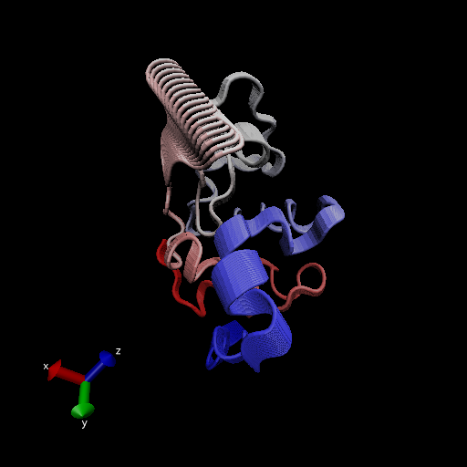

#Comparative Structure Analysis of Adenylate Kinase

Using bio3d package

```{r}
library(bio3d)

pdb <- read.pdb("1hel")
pdb
```

Let's use a bioinformatics method called NMA(Normal Mode Analysis) to predict the dynamics (flexibility) of this enzyme

```{r}
modes <- nma(pdb)
plot(modes)
```

Make a trajectory! (movie of its predicted motion).

```{r}
mktrj(modes, file="nma.pdb")
```


